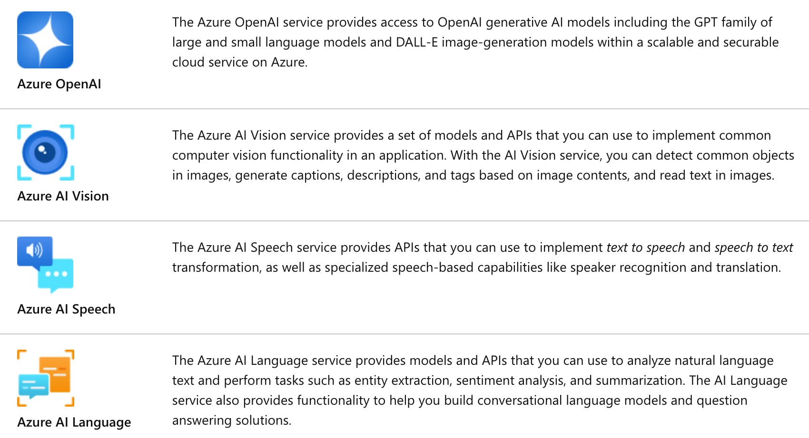
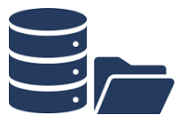
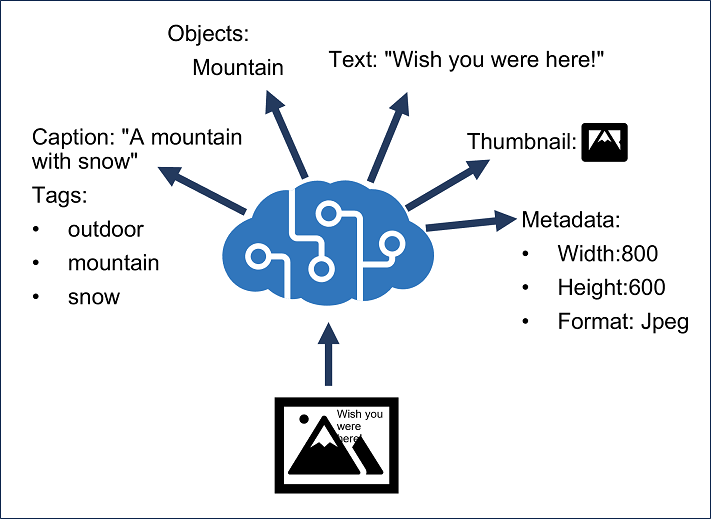
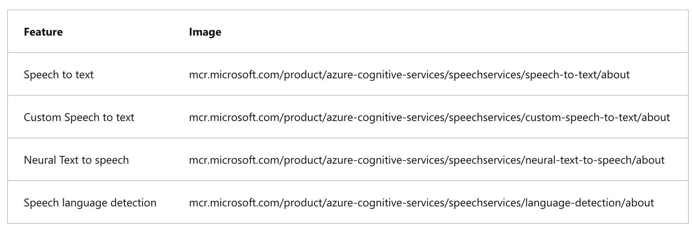
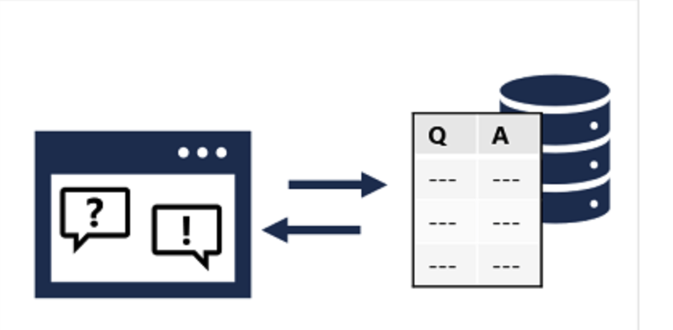
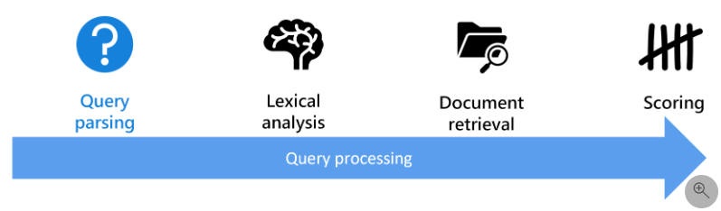
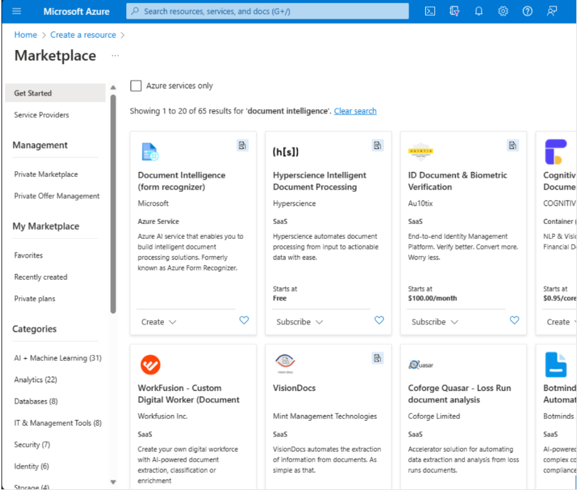
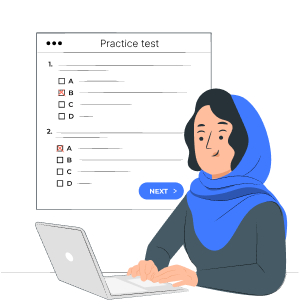

# Learner Guide - Microsoft Certified Azure AI Engineer Associate AI-102 Training

**Course Code:** TGS-2023036651
**Version:** 1.0
**Conducted by:** Tertiary Infotech Academy Pte Ltd

## Document Version Control Record

| Version Number | Effective Date of Release | Summary of Included Changes | Author |
| --- | --- | --- | --- |
| 1.0 | 8 July 2026 | First version aligned to the 10 AI-102 labs, with step-by-step lab guidance and Markdown mirror. | Tertiary Infotech Academy Pte Ltd |

## Course Overview

This Learner Guide mirrors the lab sequence for the Microsoft Certified Azure AI Engineer Associate AI-102 Training course. Work through the labs in order and complete every validation check before moving on.

## Before You Start

- Sign in to the Azure subscription or Skillable lab environment provided by the trainer.
- Create lab notes using the recommended files from the Tools Guide.
- Use the same naming convention for resources so cleanup is simple.
- Do not paste real confidential, personal, or customer data into lab prompts or documents.
- At the end of each lab, complete the validation and checkpoint questions.

## Lab 01 - Plan, Manage, Monitor, and Secure an Azure AI Solution

**Main Topic:** Planning and operations
**Source Lab:** `labs/lab-01-plan-manage-secure-azure-ai-solution.md`
**Reference Diagram:** Source PPT slide 25

### Objectives

- Select appropriate Azure AI services.
- Plan resource deployment and endpoints.
- Identify authentication, keys, monitoring, and cost controls.
- Prepare an AI solution architecture.

### Scenario

A company wants a customer support AI platform with document search, answer generation, sentiment analysis, speech transcription, and image processing. You must plan the Azure AI resources.

### Step-by-Step Lab Guide

#### Step 1: Map Requirements to Services

| Requirement | Service |
| --- | --- |
| Generate responses | Azure OpenAI in Foundry Models |
| Search internal documents | Azure AI Search |
| Analyze sentiment | Azure AI Language |
| Transcribe calls | Azure AI Speech |
| Extract text from images | Azure AI Vision |
| Extract invoice fields | Azure AI Document Intelligence |

1. Record the required outputs in your lab notes.
2. Ask the trainer to verify any uncertain configuration or design decision.

#### Step 2: Plan Foundry Resources

Document:


```text
Hub or project name
Region
Model deployment
Default endpoint
Connected data source
Responsible AI settings
```

1. Record the required outputs in your lab notes.
2. Ask the trainer to verify any uncertain configuration or design decision.

#### Step 3: Plan Security

Record:

- Role-based access control.
- Managed identities.
- Key protection.
- Private endpoint or network controls.
- Logging and diagnostics.
- Secrets storage.
1. Record the required outputs in your lab notes.
2. Ask the trainer to verify any uncertain configuration or design decision.

#### Step 4: Plan Monitoring and Cost

Document:


```text
Token or transaction usage
Latency
Errors
Content safety events
Budget alerts
Diagnostic logs
```

1. Record the required outputs in your lab notes.
2. Ask the trainer to verify any uncertain configuration or design decision.

#### Step 5: Draw Architecture

Use diagrams.net:


```text
Application -> API layer -> Foundry/Azure AI services -> Search index/storage -> Monitoring
```

1. Record the required outputs in your lab notes.
2. Ask the trainer to verify any uncertain configuration or design decision.

### Validation

You should have a service map, security plan, monitoring plan, and architecture diagram.

### Checkpoint Questions

1. Why is service selection part of AI engineering?
2. Why should keys be protected?
3. What should be monitored in an AI service?
4. What is the role of responsible AI planning?

### Course Focus

AI engineering starts with selecting the right service, securing it, monitoring it, and planning for cost and responsible use.

### Lab Alignment Diagram

| Lab Input | Design / Build Activity | Validation Output |
| --- | --- | --- |
| A company wants a customer support AI platform with document search, answer generation, sentiment analysis, speech transcription, and image processing. You must plan the Azure AI resources. | Map Requirements to Services -> Plan Foundry Resources -> Plan Security -> Plan Monitoring and Cost -> Draw Architecture | You should have a service map, security plan, monitoring plan, and architecture diagram. |

### Imported Reference Diagram



## Lab 02 - Responsible AI, Content Safety, Governance

**Main Topic:** Responsible AI
**Source Lab:** `labs/lab-02-responsible-ai-content-safety-governance.md`
**Reference Diagram:** No imported image asset found for this lab topic

### Objectives

- Apply responsible AI principles.
- Configure content safety concepts.
- Explain content filters, blocklists, prompt shields, and harm detection.
- Design a responsible AI governance framework.

### Scenario

The support AI assistant may receive abusive user input, produce inaccurate answers, or expose sensitive data. You must design responsible AI controls.

### Step-by-Step Lab Guide

#### Step 1: Review Responsible AI Principles

Write one control for:


```text
Fairness
Reliability and safety
Privacy and security
Inclusiveness
Transparency
Accountability
```

1. Record the required outputs in your lab notes.
2. Ask the trainer to verify any uncertain configuration or design decision.

#### Step 2: Define Content Safety Controls

Document:

- Harm categories.
- Severity levels.
- Content filters.
- Blocklists.
- Prompt shields.
- Groundedness checks.
- Human escalation rules.
1. Record the required outputs in your lab notes.
2. Ask the trainer to verify any uncertain configuration or design decision.

#### Step 3: Create a Safety Policy

Write:


```text
Allowed use:
Disallowed use:
Blocked content:
Human review trigger:
Audit log requirement:
Escalation owner:
Review frequency:
```

1. Record the required outputs in your lab notes.
2. Ask the trainer to verify any uncertain configuration or design decision.

#### Step 4: Test Governance Scenarios

Decide what should happen when:

- User asks for harmful instructions.
- Model produces low-confidence answer.
- Prompt contains personal data.
- Retrieved document is outdated.
- User asks for legal advice.
1. Record the required outputs in your lab notes.
2. Ask the trainer to verify any uncertain configuration or design decision.

#### Step 5: Create an Incident Plan

Define how to report, investigate, remediate, and prevent repeat AI safety incidents.

1. Record the required outputs in your lab notes.
2. Ask the trainer to verify any uncertain configuration or design decision.

### Validation

You should have responsible AI controls, safety policy, scenario decisions, and incident plan.

### Checkpoint Questions

1. What are content filters?
2. What is a prompt shield?
3. Why is human escalation important?
4. Who is accountable for AI output?

### Course Focus

Responsible AI is implemented through policy, configuration, monitoring, human review, and governance.

### Lab Alignment Diagram

| Lab Input | Design / Build Activity | Validation Output |
| --- | --- | --- |
| The support AI assistant may receive abusive user input, produce inaccurate answers, or expose sensitive data. You must design responsible AI controls. | Review Responsible AI Principles -> Define Content Safety Controls -> Create a Safety Policy -> Test Governance Scenarios -> Create an Incident Plan | You should have responsible AI controls, safety policy, scenario decisions, and incident plan. |

## Lab 03 - Generative AI, Foundry, Azure OpenAI, Prompt Flow, RAG

**Main Topic:** Generative AI
**Source Lab:** `labs/lab-03-generative-ai-foundry-openai-prompt-flow-rag.md`
**Reference Diagram:** Source PPT slide 309

### Objectives

- Plan a generative AI solution with Microsoft Foundry.
- Select and deploy a model conceptually.
- Design prompt templates and prompt flow.
- Implement a RAG pattern conceptually.
- Evaluate model and flow outputs.

### Scenario

The company wants a grounded assistant that answers questions from internal support articles and generates draft replies.

### Step-by-Step Lab Guide

#### Step 1: Select a Model

Record:


```text
Model name
Use case fit
Context window
Latency
Cost
Safety settings
Deployment option
```

1. Record the required outputs in your lab notes.
2. Ask the trainer to verify any uncertain configuration or design decision.

#### Step 2: Design Prompt Templates

Create templates for:

- Direct answer.
- Answer with sources.
- Escalation when context is missing.
1. Record the required outputs in your lab notes.
2. Ask the trainer to verify any uncertain configuration or design decision.

#### Step 3: Plan Prompt Flow

Draw:


```text
User question -> classify intent -> retrieve context -> prompt template -> model -> safety check -> response
```

1. Record the required outputs in your lab notes.
2. Ask the trainer to verify any uncertain configuration or design decision.

#### Step 4: Design RAG

Document:

- Source documents.
- Cleaning.
- Chunking.
- Embeddings.
- Vector store.
- Retrieval filters.
- Citation format.
- Evaluation method.
1. Record the required outputs in your lab notes.
2. Ask the trainer to verify any uncertain configuration or design decision.

#### Step 5: Evaluate Outputs

Score:

| Criterion | Score 1-5 |
| --- | --- |
| Correctness |  |
| Grounding |  |
| Helpfulness |  |
| Safety |  |
| Conciseness |  |

1. Record the required outputs in your lab notes.
2. Ask the trainer to verify any uncertain configuration or design decision.

### Validation

You should have model selection notes, prompt templates, prompt flow diagram, RAG design, and evaluation table.

### Checkpoint Questions

1. What is RAG?
2. Why are prompt templates useful?
3. What does tracing help debug?
4. How can feedback improve a generative AI solution?

### Course Focus

Generative AI solutions need grounded data, evaluation, safety settings, monitoring, and feedback loops.

### Lab Alignment Diagram

| Lab Input | Design / Build Activity | Validation Output |
| --- | --- | --- |
| The company wants a grounded assistant that answers questions from internal support articles and generates draft replies. | Select a Model -> Design Prompt Templates -> Plan Prompt Flow -> Design RAG -> Evaluate Outputs | You should have model selection notes, prompt templates, prompt flow diagram, RAG design, and evaluation table. |

### Imported Reference Diagram



## Lab 04 - Agentic AI, Foundry Agent Service, Multi-Agent Concepts

**Main Topic:** Agents
**Source Lab:** `labs/lab-04-agentic-ai-foundry-agent-service.md`
**Reference Diagram:** No imported image asset found for this lab topic

### Objectives

- Explain agent roles and use cases.
- Plan Foundry Agent Service resources.
- Design custom agent tools and workflows.
- Review multi-agent orchestration concepts.

### Scenario

The support AI assistant needs to look up order status, search support documents, draft a reply, and escalate complex cases to a human agent.

### Step-by-Step Lab Guide

#### Step 1: Define Agent Use Case

Write:


```text
Agent goal:
User types:
Allowed tools:
Disallowed actions:
Human escalation trigger:
Success metric:
```

1. Record the required outputs in your lab notes.
2. Ask the trainer to verify any uncertain configuration or design decision.

#### Step 2: Plan Agent Resources

Document:

- Foundry project.
- Model deployment.
- Search tool.
- Function or API tools.
- Authentication.
- Logging and trace settings.
1. Record the required outputs in your lab notes.
2. Ask the trainer to verify any uncertain configuration or design decision.

#### Step 3: Design Tool Calls

Create a table:

| Tool | Purpose | Input | Output |
| --- | --- | --- | --- |
| Search knowledge base | Retrieve support articles | Query | Relevant passages |
| Order lookup | Get order status | Order ID | Status summary |

1. Record the required outputs in your lab notes.
2. Ask the trainer to verify any uncertain configuration or design decision.

#### Step 4: Design Orchestration

Draw:


```text
User request -> agent plan -> tool call -> observation -> model reasoning -> response -> feedback
```

1. Record the required outputs in your lab notes.
2. Ask the trainer to verify any uncertain configuration or design decision.

#### Step 5: Multi-Agent Review

Explain when separate agents might be useful for retrieval, billing, technical support, and escalation review.

1. Record the required outputs in your lab notes.
2. Ask the trainer to verify any uncertain configuration or design decision.

### Validation

You should have agent use case, resource plan, tool table, orchestration diagram, and multi-agent notes.

### Checkpoint Questions

1. What is an AI agent?
2. Why do agents need tool permissions?
3. What is orchestration?
4. Why should autonomous actions be constrained?

### Course Focus

Agentic solutions combine models, tools, workflows, monitoring, safety controls, and human escalation.

### Lab Alignment Diagram

| Lab Input | Design / Build Activity | Validation Output |
| --- | --- | --- |
| The support AI assistant needs to look up order status, search support documents, draft a reply, and escalate complex cases to a human agent. | Define Agent Use Case -> Plan Agent Resources -> Design Tool Calls -> Design Orchestration -> Multi-Agent Review | You should have agent use case, resource plan, tool table, orchestration diagram, and multi-agent notes. |

## Lab 05 - Computer Vision, Custom Vision, Video Insights

**Main Topic:** Vision
**Source Lab:** `labs/lab-05-computer-vision-custom-vision-video.md`
**Reference Diagram:** Source PPT slide 73

### Objectives

- Analyze images with Azure AI Vision concepts.
- Select visual features for image processing requirements.
- Compare image classification and object detection.
- Plan custom vision training.
- Explain video insight scenarios.

### Scenario

The company wants to inspect product photos, detect damaged items, read text from images, and extract insights from product demo videos.

### Step-by-Step Lab Guide

#### Step 1: Map Vision Requirements

| Requirement | Vision Capability |
| --- | --- |
| Generate image tags | Image analysis |
| Detect product locations | Object detection |
| Read text from photos | OCR |
| Classify product condition | Image classification |
| Extract video topics | Video insights |

1. Record the required outputs in your lab notes.
2. Ask the trainer to verify any uncertain configuration or design decision.

#### Step 2: Plan an Image Request

Document:


```text
Image source
Visual features
Language
Expected response fields
Error handling
Privacy considerations
```

1. Record the required outputs in your lab notes.
2. Ask the trainer to verify any uncertain configuration or design decision.

#### Step 3: Custom Vision Plan

Choose:

| Need | Model Type |
| --- | --- |
| One label for each image | Image classification |
| Locate multiple objects | Object detection |

Document image labels, training images, evaluation metrics, publishing, and consumption.

1. Record the required outputs in your lab notes.
2. Ask the trainer to verify any uncertain configuration or design decision.

#### Step 4: Video Insights Plan

Explain how Video Indexer can extract:

- Transcript.
- Keywords.
- Faces or speakers where appropriate.
- Topics.
- Scenes.
1. Record the required outputs in your lab notes.
2. Ask the trainer to verify any uncertain configuration or design decision.

#### Step 5: Responsible AI Review

Document consent, retention, face analysis sensitivity, and human review needs.

1. Record the required outputs in your lab notes.
2. Ask the trainer to verify any uncertain configuration or design decision.

### Validation

You should have vision mapping, request plan, custom vision plan, video insight notes, and responsible AI review.

### Checkpoint Questions

1. What is OCR?
2. How is object detection different from classification?
3. What does a custom vision model require?
4. Why is video analysis sensitive?

### Course Focus

Vision solutions require selecting visual features, model type, evaluation approach, and responsible data handling.

### Lab Alignment Diagram

| Lab Input | Design / Build Activity | Validation Output |
| --- | --- | --- |
| The company wants to inspect product photos, detect damaged items, read text from images, and extract insights from product demo videos. | Map Vision Requirements -> Plan an Image Request -> Custom Vision Plan -> Video Insights Plan -> Responsible AI Review | You should have vision mapping, request plan, custom vision plan, video insight notes, and responsible AI review. |

### Imported Reference Diagram



## Lab 06 - NLP, Language, Speech, Translation

**Main Topic:** Language and speech
**Source Lab:** `labs/lab-06-nlp-language-speech-translation.md`
**Reference Diagram:** Source PPT slide 61

### Objectives

- Analyze and translate text.
- Extract key phrases, entities, PII, language, and sentiment.
- Process speech with speech-to-text and text-to-speech.
- Plan translation and SSML use.

### Scenario

The support platform must analyze customer messages, detect PII, translate text, transcribe calls, and generate spoken responses.

### Step-by-Step Lab Guide

#### Step 1: Map Language Tasks

| Scenario | Capability |
| --- | --- |
| Identify customer sentiment | Sentiment analysis |
| Extract product names | Entity recognition |
| Identify important topics | Key phrase extraction |
| Detect personal data | PII detection |
| Detect message language | Language detection |
| Translate message | Translator |

1. Record the required outputs in your lab notes.
2. Ask the trainer to verify any uncertain configuration or design decision.

#### Step 2: Design Text Analysis Pipeline


```text
Input text -> language detection -> PII detection -> sentiment -> entities -> key phrases -> route case
```

1. Record the required outputs in your lab notes.
2. Ask the trainer to verify any uncertain configuration or design decision.

#### Step 3: Design Speech Pipeline


```text
Audio input -> speech to text -> intent or keyword recognition -> response -> text to speech
```

1. Record the required outputs in your lab notes.
2. Ask the trainer to verify any uncertain configuration or design decision.

#### Step 4: SSML Review

Explain how SSML can control voice, pitch, rate, pauses, and pronunciation.

1. Record the required outputs in your lab notes.
2. Ask the trainer to verify any uncertain configuration or design decision.

#### Step 5: Translation Review

Document:

- Text translation.
- Document translation.
- Speech-to-text translation.
- Speech-to-speech translation.
- Human review for critical messages.
1. Record the required outputs in your lab notes.
2. Ask the trainer to verify any uncertain configuration or design decision.

### Validation

You should have language task mapping, text pipeline, speech pipeline, SSML notes, and translation notes.

### Checkpoint Questions

1. What is entity recognition?
2. Why detect PII before storing text?
3. What is SSML?
4. When should translation outputs be reviewed?

### Course Focus

Language and speech solutions combine analysis, privacy controls, translation, and application integration.

### Lab Alignment Diagram

| Lab Input | Design / Build Activity | Validation Output |
| --- | --- | --- |
| The support platform must analyze customer messages, detect PII, translate text, transcribe calls, and generate spoken responses. | Map Language Tasks -> Design Text Analysis Pipeline -> Design Speech Pipeline -> SSML Review -> Translation Review | You should have language task mapping, text pipeline, speech pipeline, SSML notes, and translation notes. |

### Imported Reference Diagram



## Lab 07 - Custom Language Models and Question Answering

**Main Topic:** Custom language
**Source Lab:** `labs/lab-07-custom-language-question-answering.md`
**Reference Diagram:** Source PPT slide 149

### Objectives

- Design custom language understanding.
- Define intents, entities, and utterances.
- Plan custom question answering.
- Create a multilingual question answering strategy.

### Scenario

The support assistant must recognize customer intents and answer frequently asked questions from approved sources.

### Step-by-Step Lab Guide

#### Step 1: Define Intents and Entities

Create a table:

| Intent | Example Utterance | Entities |
| --- | --- | --- |
| CheckOrderStatus | Where is order 12345? | order number |
| RequestRefund | I want a refund for my laptop | product |

1. Record the required outputs in your lab notes.
2. Ask the trainer to verify any uncertain configuration or design decision.

#### Step 2: Plan Training Data

Document:

- Number of example utterances.
- Balanced examples across intents.
- Entity labeling rules.
- Test set.
- Ambiguous utterances.
1. Record the required outputs in your lab notes.
2. Ask the trainer to verify any uncertain configuration or design decision.

#### Step 3: Plan Custom Question Answering

Record:


```text
Knowledge sources
Q&A pairs
Alternate phrasing
Chit-chat
Multi-turn prompts
Publishing target
Fallback answer
```

1. Record the required outputs in your lab notes.
2. Ask the trainer to verify any uncertain configuration or design decision.

#### Step 4: Multilingual Strategy

Explain whether to translate sources, create separate projects, or translate user input before answering.

1. Record the required outputs in your lab notes.
2. Ask the trainer to verify any uncertain configuration or design decision.

#### Step 5: Backup and Recovery

Document export, versioning, backup, and recovery of language projects.

1. Record the required outputs in your lab notes.
2. Ask the trainer to verify any uncertain configuration or design decision.

### Validation

You should have intent/entity table, training plan, question answering plan, multilingual strategy, and backup notes.

### Checkpoint Questions

1. What is an intent?
2. What is an entity?
3. Why add alternate phrasing?
4. Why should language projects be backed up?

### Course Focus

Custom language solutions need well-designed examples, evaluation, publishing, and lifecycle management.

### Lab Alignment Diagram

| Lab Input | Design / Build Activity | Validation Output |
| --- | --- | --- |
| The support assistant must recognize customer intents and answer frequently asked questions from approved sources. | Define Intents and Entities -> Plan Training Data -> Plan Custom Question Answering -> Multilingual Strategy -> Backup and Recovery | You should have intent/entity table, training plan, question answering plan, multilingual strategy, and backup notes. |

### Imported Reference Diagram



## Lab 08 - Azure AI Search, Knowledge Mining, Vector Search

**Main Topic:** Search and mining
**Source Lab:** `labs/lab-08-ai-search-knowledge-mining-vector-search.md`
**Reference Diagram:** Source PPT slide 380

### Objectives

- Design an Azure AI Search solution.
- Define indexes, data sources, indexers, and skillsets.
- Explain semantic and vector search.
- Plan knowledge store projections.

### Scenario

The company wants searchable support documents, enriched with extracted text, entities, key phrases, and vector embeddings for RAG.

### Step-by-Step Lab Guide

#### Step 1: Design an Index

Define fields:


```text
id
title
content
category
source_url
last_updated
security_label
embedding
```

1. Record the required outputs in your lab notes.
2. Ask the trainer to verify any uncertain configuration or design decision.

#### Step 2: Plan Data Sources and Indexers

Document:

- Source storage.
- Supported document formats.
- Indexer schedule.
- Change detection.
- Error handling.
1. Record the required outputs in your lab notes.
2. Ask the trainer to verify any uncertain configuration or design decision.

#### Step 3: Define a Skillset

Include:

- OCR.
- Language detection.
- Entity extraction.
- Key phrase extraction.
- Custom skill.
- Embedding generation.
1. Record the required outputs in your lab notes.
2. Ask the trainer to verify any uncertain configuration or design decision.

#### Step 4: Query Design

Write examples for:


```text
Keyword search
Filter by category
Sort by last updated
Wildcard query
Semantic ranking
Vector search
Hybrid search
```

1. Record the required outputs in your lab notes.
2. Ask the trainer to verify any uncertain configuration or design decision.

#### Step 5: Knowledge Store Projections

Explain file, object, and table projections and when enriched output should be stored.

1. Record the required outputs in your lab notes.
2. Ask the trainer to verify any uncertain configuration or design decision.

### Validation

You should have index design, data source/indexer plan, skillset plan, query examples, and knowledge store notes.

### Checkpoint Questions

1. What is an indexer?
2. What is a skillset?
3. What is vector search?
4. Why use semantic ranking?

### Course Focus

Knowledge mining combines source data, enrichment, indexing, querying, and optional vector retrieval for AI applications.

### Lab Alignment Diagram

| Lab Input | Design / Build Activity | Validation Output |
| --- | --- | --- |
| The company wants searchable support documents, enriched with extracted text, entities, key phrases, and vector embeddings for RAG. | Design an Index -> Plan Data Sources and Indexers -> Define a Skillset -> Query Design -> Knowledge Store Projections | You should have index design, data source/indexer plan, skillset plan, query examples, and knowledge store notes. |

### Imported Reference Diagram



## Lab 09 - Document Intelligence and Content Understanding

**Main Topic:** Document AI
**Source Lab:** `labs/lab-09-document-intelligence-content-understanding.md`
**Reference Diagram:** Source PPT slide 532

### Objectives

- Use prebuilt document extraction concepts.
- Plan custom Document Intelligence models.
- Explain composed models.
- Design Content Understanding extraction workflows.

### Scenario

The company processes invoices, contracts, support screenshots, audio notes, and product videos. It wants to extract structured information from multiple content types.

### Step-by-Step Lab Guide

#### Step 1: Map Document Scenarios

| Scenario | Capability |
| --- | --- |
| Extract invoice fields | Prebuilt invoice model |
| Extract custom form fields | Custom document model |
| Route different form types | Composed model |
| Extract table data | Layout and table extraction |
| Extract text from images | OCR pipeline |

1. Record the required outputs in your lab notes.
2. Ask the trainer to verify any uncertain configuration or design decision.

#### Step 2: Custom Document Model Plan

Document:


```text
Document types
Sample count
Fields to extract
Labels
Training split
Evaluation metric
Publish plan
```

1. Record the required outputs in your lab notes.
2. Ask the trainer to verify any uncertain configuration or design decision.

#### Step 3: Content Understanding Plan

Explain extraction from:

- Documents.
- Images.
- Video.
- Audio.
Include summarization, classification, attributes, entities, tables, and images.

1. Record the required outputs in your lab notes.
2. Ask the trainer to verify any uncertain configuration or design decision.

#### Step 4: Human Review Rules

Define confidence thresholds and when extracted data requires review.

1. Record the required outputs in your lab notes.
2. Ask the trainer to verify any uncertain configuration or design decision.

#### Step 5: Integration Flow

Draw:


```text
Upload content -> extract text/entities/tables -> validate -> store structured data -> search/report
```

1. Record the required outputs in your lab notes.
2. Ask the trainer to verify any uncertain configuration or design decision.

### Validation

You should have scenario mapping, custom model plan, content understanding plan, review rules, and integration flow.

### Checkpoint Questions

1. When should you use a prebuilt model?
2. What is a composed model?
3. Why are confidence scores useful?
4. What content types can Content Understanding process?

### Course Focus

Information extraction solutions need model selection, training data, confidence handling, and integration design.

### Lab Alignment Diagram

| Lab Input | Design / Build Activity | Validation Output |
| --- | --- | --- |
| The company processes invoices, contracts, support screenshots, audio notes, and product videos. It wants to extract structured information from multiple content types. | Map Document Scenarios -> Custom Document Model Plan -> Content Understanding Plan -> Human Review Rules -> Integration Flow | You should have scenario mapping, custom model plan, content understanding plan, review rules, and integration flow. |

### Imported Reference Diagram



## Lab 10 - AI-102 Capstone and Course Review

**Main Topic:** Integrated review
**Source Lab:** `labs/lab-10-ai102-capstone-course-review.md`
**Reference Diagram:** Source PPT slide 716

### Objectives

- Design an end-to-end Azure AI solution.
- Map requirements to Microsoft Foundry and Azure AI services.
- Include security, monitoring, responsible AI, and cost controls.
- Build a personal review plan.

### Scenario

You must design a production-ready customer support AI platform that supports grounded chat, document search, sentiment analysis, speech transcription, image OCR, document extraction, and human escalation.

### Step-by-Step Lab Guide

#### Step 1: Build a Service Map

| Requirement | Service |
| --- | --- |
| Grounded assistant | Foundry, Azure OpenAI, prompt flow, RAG |
| Agent workflow | Foundry Agent Service |
| Document search | Azure AI Search |
| Sentiment and PII | Azure AI Language |
| Speech transcription | Azure AI Speech |
| Image OCR | Azure AI Vision |
| Invoice extraction | Document Intelligence |
| Multi-content extraction | Content Understanding |
| Safety controls | Content Safety and responsible AI governance |

1. Record the required outputs in your lab notes.
2. Ask the trainer to verify any uncertain configuration or design decision.

#### Step 2: Draw the Architecture

Include:


```text
User application
API layer
Foundry project
Model deployment
AI Search index
Storage
Language/Speech/Vision/Document services
Monitoring
Human review queue
```

1. Record the required outputs in your lab notes.
2. Ask the trainer to verify any uncertain configuration or design decision.

#### Step 3: Add Governance Controls

Document:

- RBAC.
- Managed identity.
- Key protection.
- Prompt filters.
- Content safety.
- Logging and monitoring.
- Budget alerts.
- Data retention.
- Human escalation.
1. Record the required outputs in your lab notes.
2. Ask the trainer to verify any uncertain configuration or design decision.

#### Step 4: Rate Skill Confidence

| Skill Area | Confidence 1-5 | Study Action |
| --- | --- | --- |
| Plan and manage Azure AI solution |  |  |
| Implement generative AI solutions |  |  |
| Implement agentic solution |  |  |
| Implement computer vision solutions |  |  |
| Implement NLP solutions |  |  |
| Implement knowledge mining and information extraction |  |  |

1. Record the required outputs in your lab notes.
2. Ask the trainer to verify any uncertain configuration or design decision.

#### Step 5: Clean Up Resources

If you created resources:


```bash
az group delete --name rg-ai102-lab --yes --no-wait
```

Confirm with your instructor before deleting shared resources.

1. Record the required outputs in your lab notes.
2. Ask the trainer to verify any uncertain configuration or design decision.

#### Step 6: Create a 7-Day Review Plan

- Day 1: Planning, security, monitoring, responsible AI.
- Day 2: Generative AI, prompt flow, RAG.
- Day 3: Agents and orchestration.
- Day 4: Vision and video.
- Day 5: NLP, speech, translation, question answering.
- Day 6: AI Search, Document Intelligence, Content Understanding.
- Day 7: Capstone review and mistakes log.
1. Record the required outputs in your lab notes.
2. Ask the trainer to verify any uncertain configuration or design decision.

### Validation

You should have a service map, architecture diagram, governance checklist, confidence matrix, cleanup plan, and review plan.

### Checkpoint Questions

1. Which service should power grounded document search?
2. When should a human review AI output?
3. What is the difference between RAG and fine-tuning?
4. Which AI workload do you need to review most?

### Course Focus

Azure AI engineering is about integrating the right AI services into secure, monitored, responsible, production-ready solutions.

### Lab Alignment Diagram

| Lab Input | Design / Build Activity | Validation Output |
| --- | --- | --- |
| You must design a production-ready customer support AI platform that supports grounded chat, document search, sentiment analysis, speech transcription, image OCR, document extraction, and human escalation. | Build a Service Map -> Draw the Architecture -> Add Governance Controls -> Rate Skill Confidence -> Clean Up Resources -> Create a 7-Day Review Plan | You should have a service map, architecture diagram, governance checklist, confidence matrix, cleanup plan, and review plan. |

### Imported Reference Diagram



## Cleanup Checklist

- Delete training resource groups only when instructed by the trainer.
- Remove Foundry projects, model deployments, search indexes, storage accounts, and document processing resources created only for training.
- Confirm that no lab keys, endpoint values, or copied sample data remain in shared notes.
